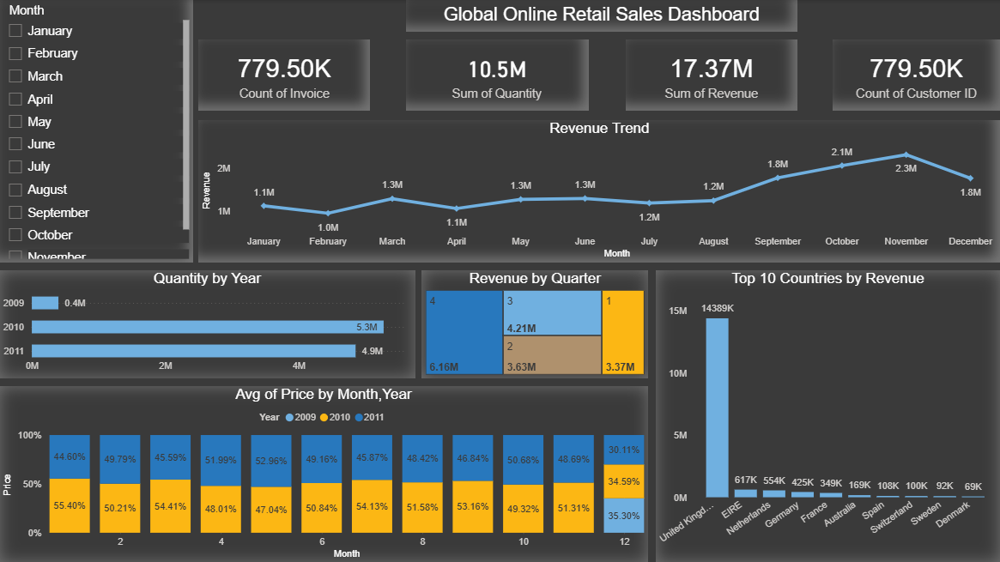

# Online Retail Sales Analysis & Dashboard

## Project Overview
This project analyzes an online retail dataset to understand sales performance, customer behavior, and revenue trends.  

The project demonstrates a complete data analysis workflow, starting from raw transactional data, performing data cleaning and exploratory analysis using Python, and finally building an interactive sales dashboard using Power BI.

The goal of this project is to transform raw data into meaningful insights that can support business decisions.

---

## Tools & Technologies
- Python
- Pandas
- NumPy
- Matplotlib
- Power BI
- Data Cleaning
- Exploratory Data Analysis (EDA)
- Data Visualization

---

## Dataset
The dataset used in this project is Online Retail II, which contains transactional data from a UK-based online retail store.

The dataset includes information such as:

- Invoice Number
- Stock Code
- Product Description
- Quantity
- Invoice Date
- Unit Price
- Customer ID
- Country

---

# Part 1 — Data Analysis using Python

## Data Cleaning
Several preprocessing steps were applied to prepare the dataset for analysis:

- Handling missing values
- Removing duplicate records
- Filtering invalid or cancelled transactions
- Fixing data types
- Selecting numerical columns for correlation analysis

---

## Feature Engineering
New analytical features were created to enhance the analysis:

- Revenue = Quantity × Unit Price
- Status -> if Revenu >=1000 return "High" else return "Low"
- Month
- Year
- Quarter

These new features allowed better analysis of sales trends over time.

---

## Exploratory Data Analysis
Exploratory analysis was performed to understand patterns in the dataset.

Key analyses included:

- Revenue by Country
- Quantity Sold by Country
- Product Status Analysis
- Correlation between numerical features

Data visualization was performed using Matplotlib.

---

# Part 2 — Power BI Dashboard

After completing the analysis in Python, an interactive dashboard was built using Power BI to visualize the insights.

The dashboard provides a clear overview of sales performance.

---

## Dashboard Features

The dashboard includes the following key metrics:

- Total Revenue
- Total Orders
- Total Quantity Sold
- Total Customers

---

## Sales Analysis

The dashboard also includes visualizations such as:

- Monthly Revenue Trend
- Top 10 Countries by Revenue
- Quantity Sold by Year
- Average Price Trend

These visualizations help understand how sales change over time and across different regions.

---

## Dashboard Preview

---

## Key Insights

Some insights discovered during the analysis include:

- The United Kingdom contributes the largest share of total revenue.
- Sales tend to increase toward the end of the year.
- A small number of countries generate a large portion of the total sales.
- Sales trends show clear seasonal patterns.

---

## Future Improvements

Possible improvements for this project include:

- Customer segmentation analysis
- Sales forecasting using machine learning
- Building a fully interactive business intelligence report

---

## Author

Ahmad Balata  
Data Analyst
